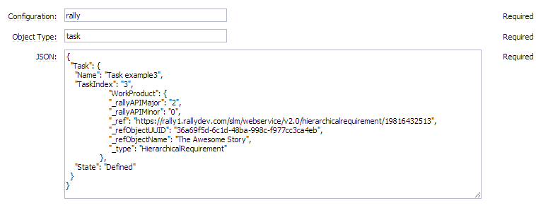
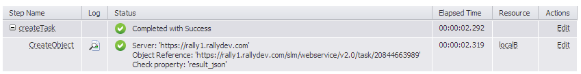
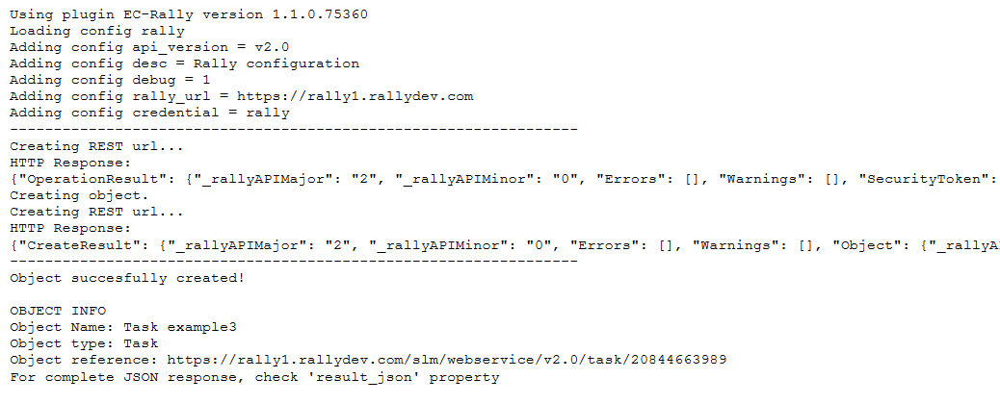
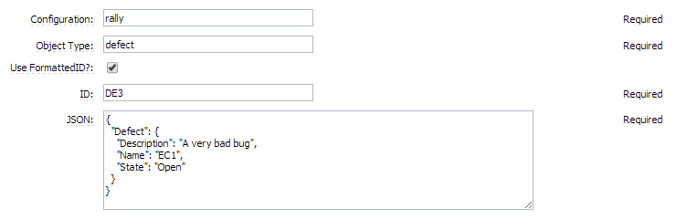
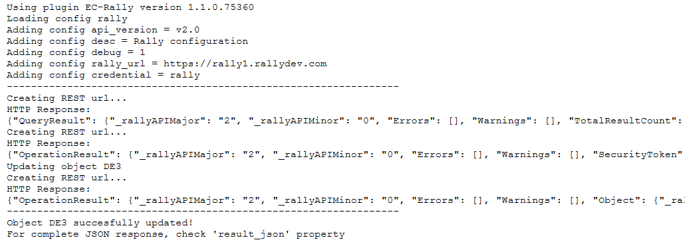
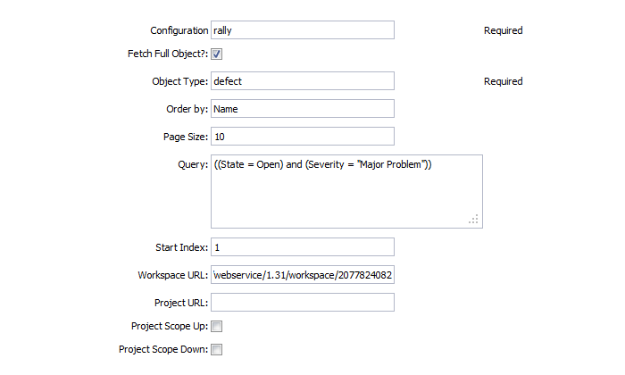
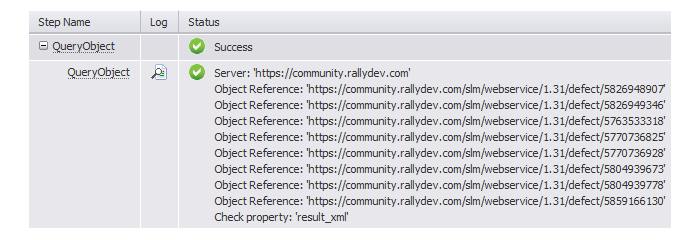

# EC-Rally

The EC-Rally plugin enables you to create, read, update, delete and query Rally objects. This plugin also links to reports that contains information from the Rally server about what was linked, updated, or created.

The plugin interact with Rally API using PERL and JSON to perform the following tasks:

- Create configuration to hold connection information.

- Query for objects information.

- Create, read, delete, and update objects.

For more information, refer to [Rally Software](https://www.broadcom.com/products/software/value-stream-management/rally).

# Integrated version

This plugin was developed and tested against version Rally Community Edition - Build 2012.03.24-3.

# Plugin procedures

For all parameter descriptions below, required parameters are shown in
bold italics.

## Plugin configuration

Plugin configurations are sets of parameters that apply across some or
all of the plugin’s procedures. They are intended to reduce repetition
of common values, create predefined sets of parameters for end users,
and to securely store credentials where needed. Each configuration is
given a unique name that is entered in designated parameters on
procedures that use them.

<table>
<colgroup>
<col style="width: 50%" />
<col style="width: 50%" />
</colgroup>
<thead>
<tr class="header">
<th style="text-align: left;">Parameter</th>
<th style="text-align: left;">Description</th>
</tr>
</thead>
<tbody>
<tr class="odd">
<td style="text-align: left;">
Configuration Name
</td>
<td style="text-align: left;">
Provide a unique name for the
configuration, keeping in mind that you may need to create additional
configurations over time. (Required)
</td>
</tr>
<tr class="even">
<td style="text-align: left;">
Description
</td>
<td style="text-align: left;">
Provide a simple description for this
configuration.
</td>
</tr>
<tr class="odd">
<td style="text-align: left;">
Rally Url
</td>
<td style="text-align: left;">
Provide the host name or IP address of
the Rally server. (Required)
</td>
</tr>
<tr class="even">
<td style="text-align: left;">
Configuration Credential
Parameters
</td>
<td style="text-align: left;">
Rally account username/password or API
key name/API key. This credential must have enough privileges to perform
API functions.
</td>
</tr>
<tr class="odd">
<td style="text-align: left;">
Debug Level
</td>
<td style="text-align: left;">
Level for output: 0=errors only,
1=normal headers and responses, 2+=debugging information included.
(Required)
</td>
</tr>
<tr class="even">
<td style="text-align: left;">
API version
</td>
<td style="text-align: left;">
API version to use. (Required)
</td>
</tr>
</tbody>
</table>

## CreateObject

This procedure allows you to create a new Object on your Rally server.

<table>
<colgroup>
<col style="width: 50%" />
<col style="width: 50%" />
</colgroup>
<thead>
<tr class="header">
<th style="text-align: left;">Parameter</th>
<th style="text-align: left;">Description</th>
</tr>
</thead>
<tbody>
<tr class="odd">
<td style="text-align: left;">
<b>Configuration</b>
</td>
<td style="text-align: left;">
The name of the configuration which
holds all the connection information for Rally. This must reference a
valid existing configuration. (Required)
</td>
</tr>
<tr class="even">
<td style="text-align: left;">
<b>Object Type</b>
</td>
<td style="text-align: left;">
Provide the object type to perform the
create operation. (Required)
</td>
</tr>
<tr class="odd">
<td style="text-align: left;">
<b>JSON</b>
</td>
<td style="text-align: left;">
Provide the JSON structure of the
object to create. (Required)
</td>
</tr>
</tbody>
</table>

## ReadObject

This procedure allows you to read an Object on Rally server, and return
the json.

<table>
<colgroup>
<col style="width: 50%" />
<col style="width: 50%" />
</colgroup>
<thead>
<tr class="header">
<th style="text-align: left;">Parameter</th>
<th style="text-align: left;">Description</th>
</tr>
</thead>
<tbody>
<tr class="odd">
<td style="text-align: left;">
<b>Configuration</b>
</td>
<td style="text-align: left;">
The name of the configuration which
holds all the connection information for Rally. This must reference a
valid existing configuration. (Required)
</td>
</tr>
<tr class="even">
<td style="text-align: left;">
<b>Object Type</b>
</td>
<td style="text-align: left;">
Provide the object type to perform the
read operation. (Required)
</td>
</tr>
<tr class="odd">
<td style="text-align: left;">
Use FormattedID?:
</td>
<td style="text-align: left;">
If selected, specify the FormattedID in
the next field, if not selected, use ObjectID.
</td>
</tr>
<tr class="even">
<td style="text-align: left;">
<b>ID</b>
</td>
<td style="text-align: left;">
Provide the ID of the object (e.g.
DE1057 or 205918369687). (Required)
</td>
</tr>
</tbody>
</table>

## UpdateObject

This procedure allows you to update an existing Object on Rally server.

<table>
<colgroup>
<col style="width: 50%" />
<col style="width: 50%" />
</colgroup>
<thead>
<tr class="header">
<th style="text-align: left;">Parameter</th>
<th style="text-align: left;">Description</th>
</tr>
</thead>
<tbody>
<tr class="odd">
<td style="text-align: left;">
<b>Configuration</b>
</td>
<td style="text-align: left;">
The name of the configuration which
holds all the connection information for Rally. This must reference a
valid existing configuration. (Required)
</td>
</tr>
<tr class="even">
<td style="text-align: left;">
<b>Object Type</b>
</td>
<td style="text-align: left;">
Provide the object type to perform the
update operation. (Required)
</td>
</tr>
<tr class="odd">
<td style="text-align: left;">
Use FormattedID?:
</td>
<td style="text-align: left;">
If selected, specify the FormattedID in
the next field, if not selected, use ObjectID.
</td>
</tr>
<tr class="even">
<td style="text-align: left;">
<b>ID</b>
</td>
<td style="text-align: left;">
Provide the ID of the object (e.g.
DE1057 or 205918369687). (Required)
</td>
</tr>
<tr class="odd">
<td style="text-align: left;">
<b>JSON</b>
</td>
<td style="text-align: left;">
Provide the JSON structure with the
attributes of the object to update. (Required)
</td>
</tr>
</tbody>
</table>

## DeleteObject

This procedure allows you to delete an existing Object on Rally server.

<table>
<colgroup>
<col style="width: 50%" />
<col style="width: 50%" />
</colgroup>
<thead>
<tr class="header">
<th style="text-align: left;">Parameter</th>
<th style="text-align: left;">Description</th>
</tr>
</thead>
<tbody>
<tr class="odd">
<td style="text-align: left;">
<b>Configuration</b>
</td>
<td style="text-align: left;">
The name of the configuration which
holds all the connection information for Rally. This must reference a
valid existing configuration. (Required)
</td>
</tr>
<tr class="even">
<td style="text-align: left;">
<b>Object Type</b>
</td>
<td style="text-align: left;">
Provide the object type to perform the
delete operation. (Required)
</td>
</tr>
<tr class="odd">
<td style="text-align: left;">
Use FormattedID?:
</td>
<td style="text-align: left;">
If selected, specify the FormattedID in
the next field, if not selected, use ObjectID.
</td>
</tr>
<tr class="even">
<td style="text-align: left;">
<b>ID</b>
</td>
<td style="text-align: left;">
Provide the ID of the object (e.g.
DE1057 or 205918369687). (Required)
</td>
</tr>
</tbody>
</table>

## QueryObject

This procedure allows you to Query for objects on Rally server.

<table>
<colgroup>
<col style="width: 50%" />
<col style="width: 50%" />
</colgroup>
<thead>
<tr class="header">
<th style="text-align: left;">Parameter</th>
<th style="text-align: left;">Description</th>
</tr>
</thead>
<tbody>
<tr class="odd">
<td style="text-align: left;">
<b>Configuration</b>
</td>
<td style="text-align: left;">
The name of the configuration which
holds all the connection information for Rally. This must reference a
valid existing configuration. (Required)
</td>
</tr>
<tr class="even">
<td style="text-align: left;">
Fetch Full Object?
</td>
<td style="text-align: left;">
Fetch the complete json structure of
the object.
</td>
</tr>
<tr class="odd">
<td style="text-align: left;">
<b>Object Type</b>
</td>
<td style="text-align: left;">
Provide the object type to query the
create operation. (Required)
</td>
</tr>
<tr class="even">
<td style="text-align: left;">
Order by
</td>
<td style="text-align: left;">
Provide the Attribute to order the
results. (e.g. Priority desc,Severity)
</td>
</tr>
<tr class="odd">
<td style="text-align: left;">
Page Size
</td>
<td style="text-align: left;">
Page size for results. Must be greater
than 0 and not more than 100, default is 20.
</td>
</tr>
<tr class="even">
<td style="text-align: left;">
Query
</td>
<td style="text-align: left;">
A query string (e.g. Name contains "foo") and (TargetBuild =
"12345", (Description contains "baz"))
</td>
</tr>
<tr class="odd">
<td style="text-align: left;">
Start Index
</td>
<td style="text-align: left;">
Start index (1-based) for queries. The
default is 1.
</td>
</tr>
<tr class="even">
<td style="text-align: left;">
Workspace URL:
</td>
<td style="text-align: left;">
If not present, then the query will run
in the user’s default workspace. If present, this should be the REST URL
of the workspace the user wants to search in. (e.g. <a href="https://community.rallydev.com/slm/webservice/1.31/workspace/2077">https://community.rallydev.com/slm/webservice/1.31/workspace/2077</a>)
</td>
</tr>
<tr class="odd">
<td style="text-align: left;">
Project URL:
</td>
<td style="text-align: left;">
If not set, or specified as "null" then
the "parent project" in the given workspace is used. If set, this should
be the REST URI of the project. You may omit the "Workspace URL"
parameter because the workspace will be inherited from the project.
(e.g. <a href="https://community.rallydev.com/slm/webservice/1.31/project/2078">https://community.rallydev.com/slm/webservice/1.31/project/2078</a>)
</td>
</tr>
<tr class="even">
<td style="text-align: left;">
Project Scope Up:
</td>
<td style="text-align: left;">
In addition to the specified project,
include projects above the specified one. (Default is true)
</td>
</tr>
<tr class="odd">
<td style="text-align: left;">
Project Scope Down:
</td>
<td style="text-align: left;">
In addition to the specified project,
include child projects below the current one. (Default is true)
</td>
</tr>
</tbody>
</table>

# Examples and use cases

## Create a task

Create a new CreateObject procedure, fill in the requested parameters
with real values from your Rally server:

CreateObject job:

CreateObject output:

## Update a defect

Create a new UpdateObject procedure, fill in the requested parameters
with real values from your Rally server:

UpdateObject output:

## Query for open defects

Create a new QueryObject procedure, fill in the requested parameters
with real values from your Rally server:

QueryObject job:

# Release notes

## EC-Rally 1.2.0

-   Migrated plugin to community.

-   Added support for new plugin configurations.

## EC-Rally 1.1.4

-   Added session validation.

## EC-Rally 1.1.3

-   Migrated documentation to the main documentation site. (Deprecated.)

## EC-Rally 1.1.2

-   Updated plugin icon.

## EC-Rally 1.1.1

-   Fixed issue with configurations being cached for Internet Explorer&reg;.

-   Added support API keys authorization.

## EC-Rally 1.1.0

-   Enable support for Rally API V2.0 (JSON).

-   Remove need for shared directory with agent (agent/lib) directory.

-   Minimum Commander Server version is now 4.2.

## EC-Rally 1.0.2

-   Added UTF-8 support.

## EC-Rally 1.0.1

-   Procedure name(s) were changed in the **StepPicker** section.

## EC-Rally 1.0.0

-   Implemented configuration management.

-   Added procedures: 
    - **CreateObject**
    - **ReadObject**
    - **UpdateObject**
    - **DeleteObject**
    - **QueryObject**

-   Implemented XML parameter panel

-   Created help page.

-   Added procedures to **StepPicker**.
